# From Data to Justice

<div align="center">

&nbsp;&nbsp;&nbsp;

</div>

> **In 10 seconds:**
> - **Models** — offender **sex** (classifier) and **age** (regressor) predicted from case attributes of **573k solved FBI homicides** (1976–2022), built to profile unknown offenders in unsolved cases
> - **Scores** (held-out test, leak-free) — sex: macro-F1 **0.635**, ROC-AUC 0.75 (always-Male baseline: 0.469) · age: R² **0.257**, MAE 8.4 years
> - **Experiments** — **9 oversampling strategies × 5 model families**, samplers fit on the training fold only; winner **SMOTEENN + XGBoost**; full grid in [`experiments/results/`](experiments/results/)
> - **Graphs** — 16 EDA charts (R) below, plus an executed [notebook](notebook.ipynb) with the leak demo, sweep chart and test report
> - **Ships as** — Python package `shr/` + FastAPI `/predict` + Docker image + AWS App Runner scripts, pre-trained models included

This project aligns with the goal of the [Murder Accountability Project](https://www.murderdata.org/): machine learning models that predict **offender sex** and **offender age** from case attributes, trained on solved homicides so they can be applied to unsolved ones.

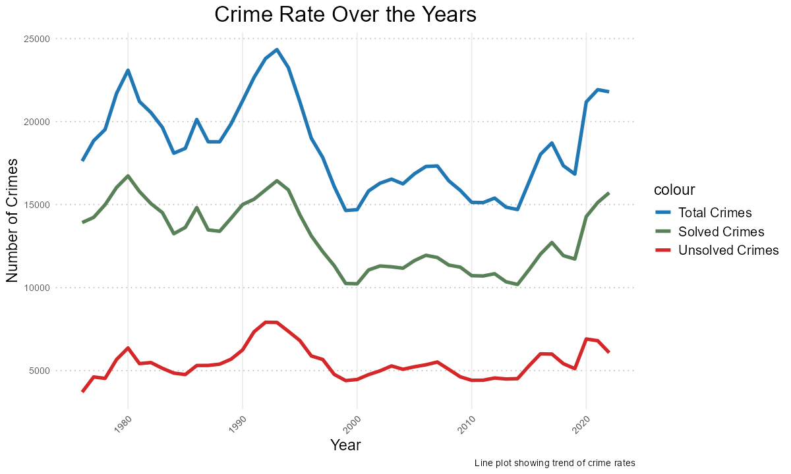

---

## Dataset

[Data](https://www.murderdata.org/p/data-docs.html) comes from the Murder Accountability Project: over **870k** homicide cases reported from 1976 to 2022, solved and unsolved, with 30 features — Victim Sex, Victim Age, Year, Month, Agency, Weapon, Victim Race, State, and so on.

After keeping solved cases with a known offender and dropping unknown-age/sex sentinels, **573,172 cases** remain for supervised learning. Offender sex is heavily imbalanced: **88.3% Male / 11.7% Female** — which is exactly why oversampling entered the picture.

---

### EDA

Exploratory data analysis was conducted in R (**EDA_R_code.qmd**) to find trends and judge feature importance for prediction.

---

#### 1. Solved and unsolved cases:

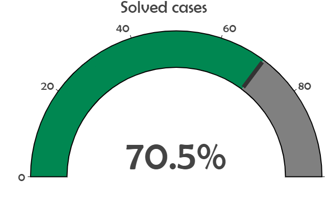

Only **70.5%** of cases are solved — over **256k** cases remain unsolved.

---

#### 2. States with the most homicide cases:

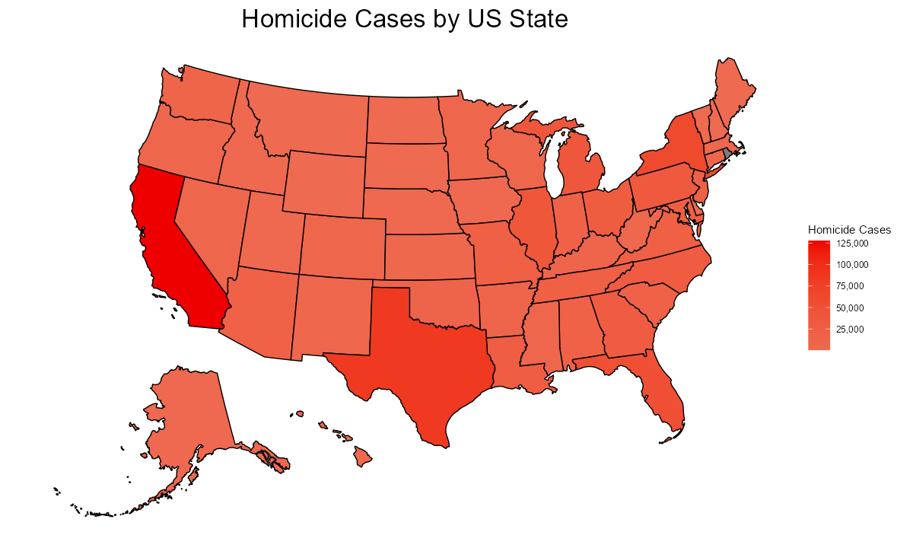

**California** and **Texas** stand out among the 50 US states.

---

#### 3. States' unsolved homicides:

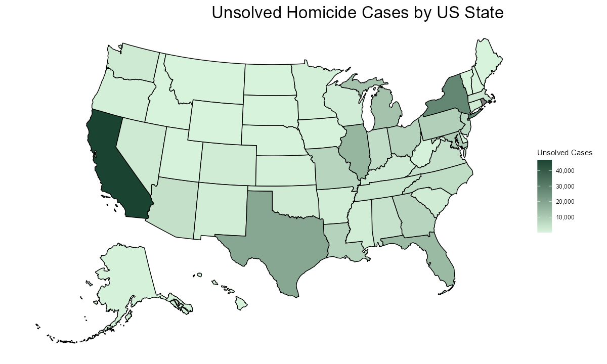

Again **California** and **Texas** are notable, joined by **New York**.

---

#### 4. Weapons of choice:


The most common weapon is the **handgun** — by a wide margin, and for both offender sexes:

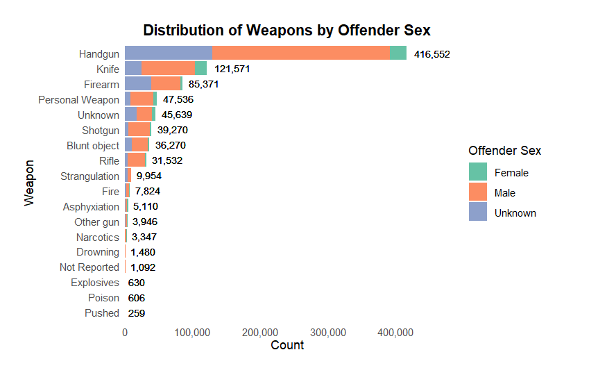

---

#### 5. Relationship between offender and victim:

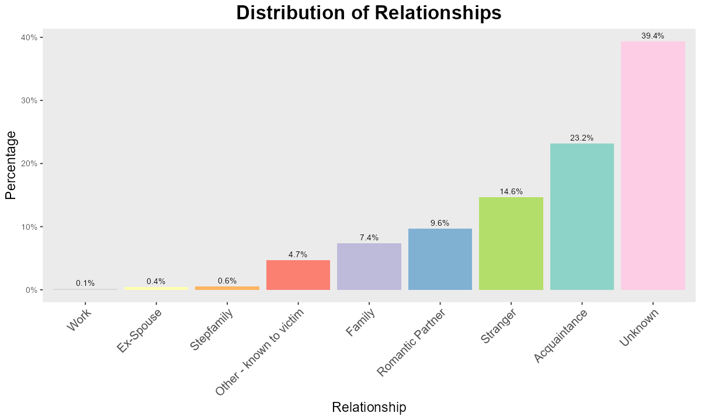

- Relationships are grouped for readability. Solved cases show a spread of relationships; in unsolved cases the value is simply **Unknown**.
- **Relationship** therefore carries no signal for unsolved cases and is excluded from the models.

---

#### 6. Victim and offender ages:

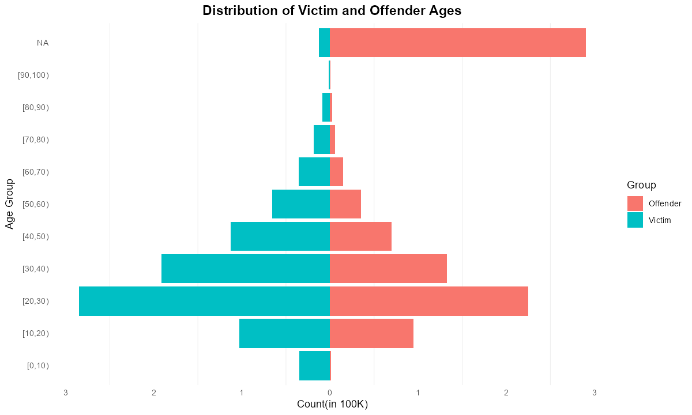

- Victims and offenders concentrate between 20 and 40; the large NA column comes from unknown offender ages in unsolved cases.
- Offender age rises and falls with victim age — it is one of the two targets we predict.

---

#### 7. Victim and offender sex:

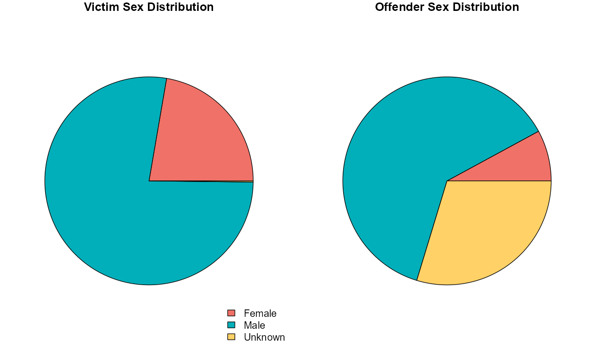

- Most homicides are committed by and against males.
- The large **Unknown** slice in offender sex (unsolved cases) is the reason offender sex is the classification target.

---

#### 8. Years:

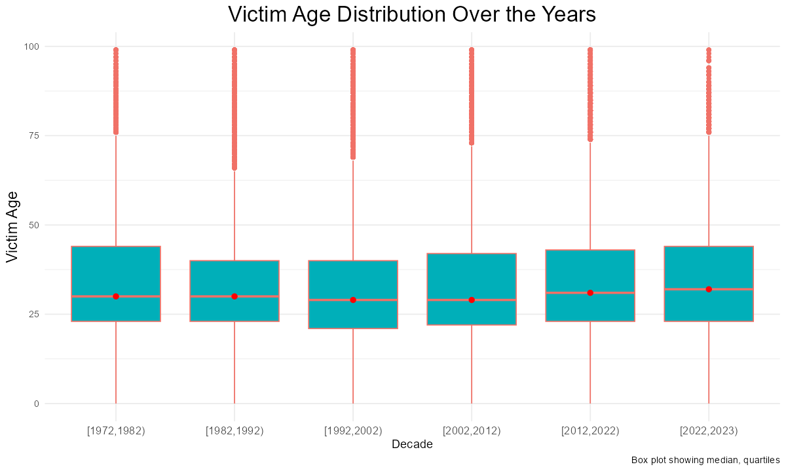

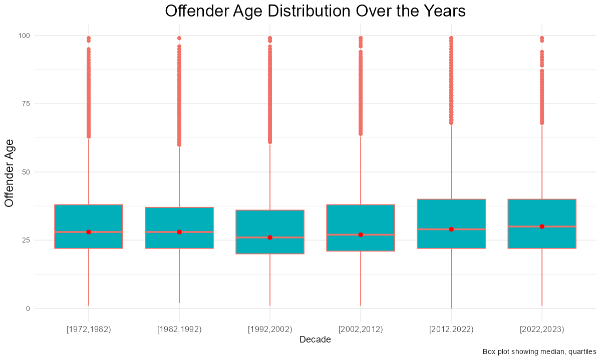

- No clear pattern in victim or offender age across years.

##### Maybe decades are the wrong grain — trying seasons with a denser chart:

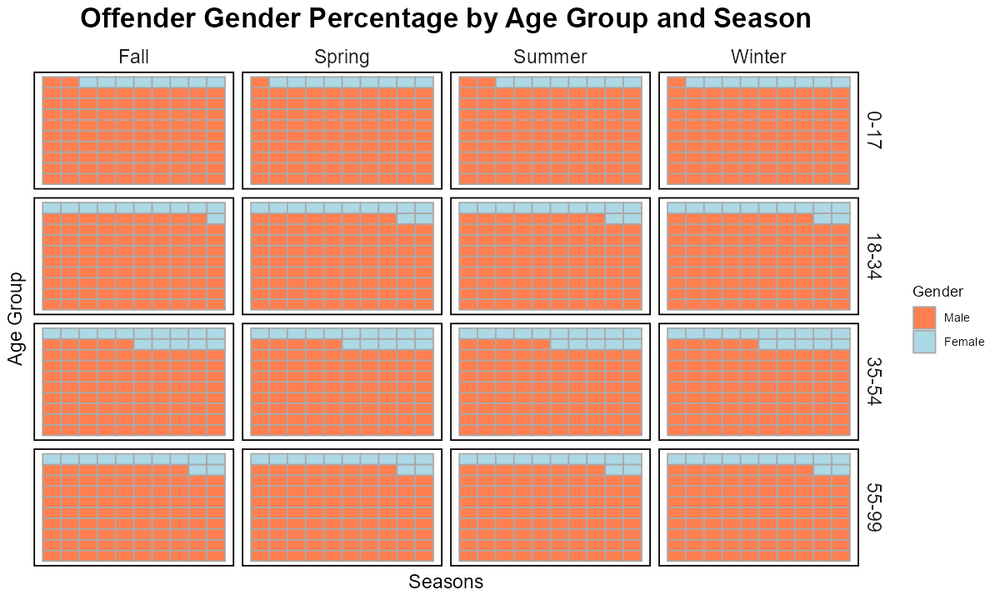

- Still no pattern; calendar features carry little signal on their own, but Year/Month stay in as cheap inputs the trees can use or ignore.

---

#### 9. Agency type:

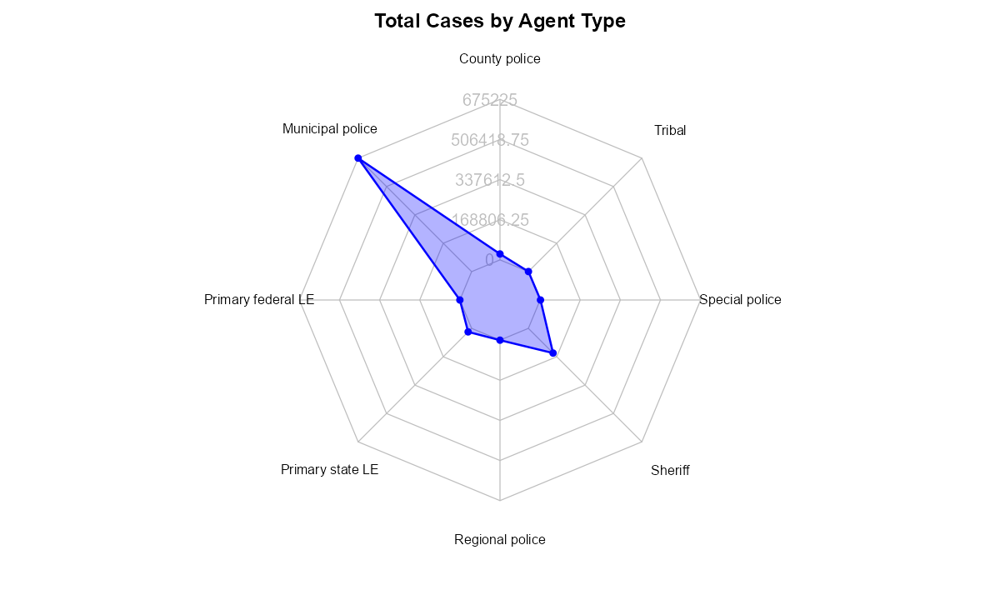

**Municipal police** handle by far the most homicide cases.

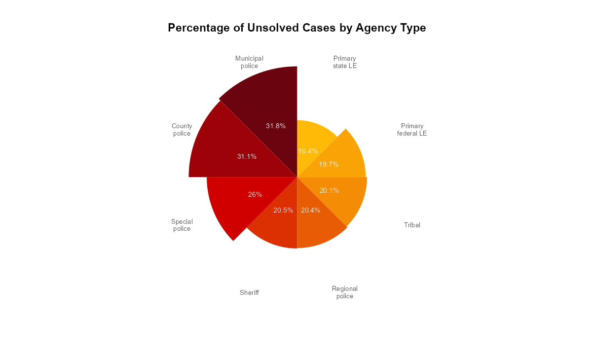

- Unsurprisingly, municipal police also hold the most pending cases (**31.8%**).
- Surprisingly, **county police** and **special police**, despite far fewer cases, still have **31.1%** and **26%** unsolved respectively.

---

#### 10. States and offenders:

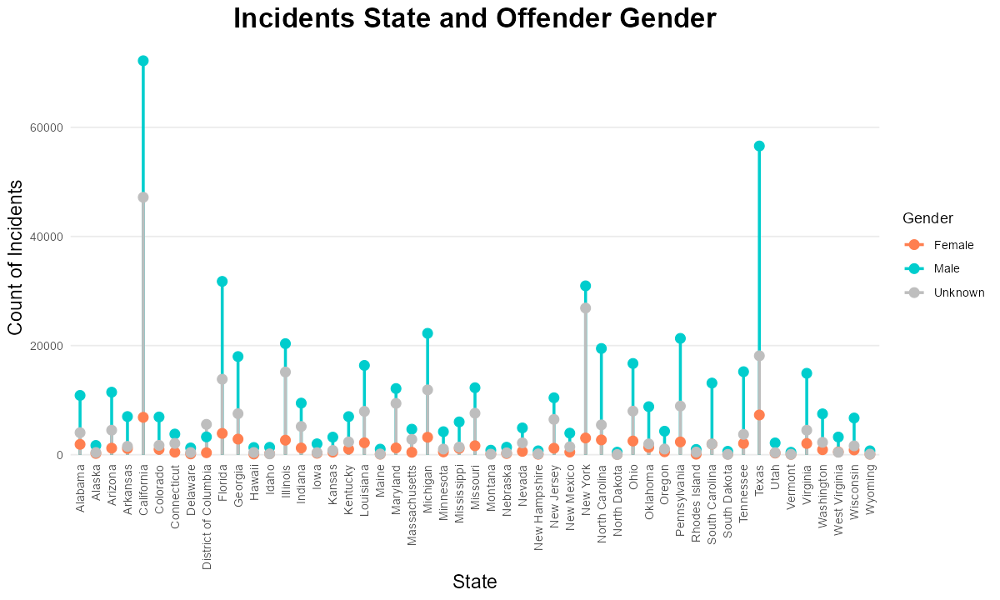

**California**, **Texas** and **New York** have a high number of unknown-sex offenders — State is a relevant variable.

---

#### 11. Race:

- **Offender race and ethnicity** are unknown in unsolved cases for obvious reasons, so they cannot be inputs.
- **Victim race** is available in both populations:

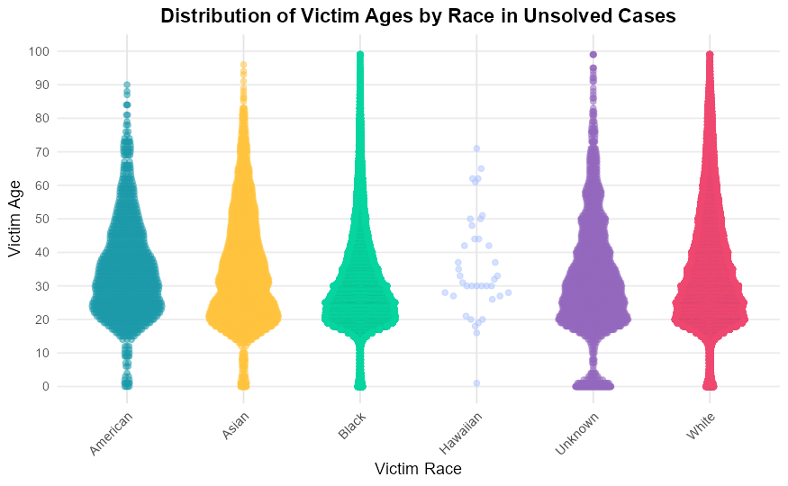

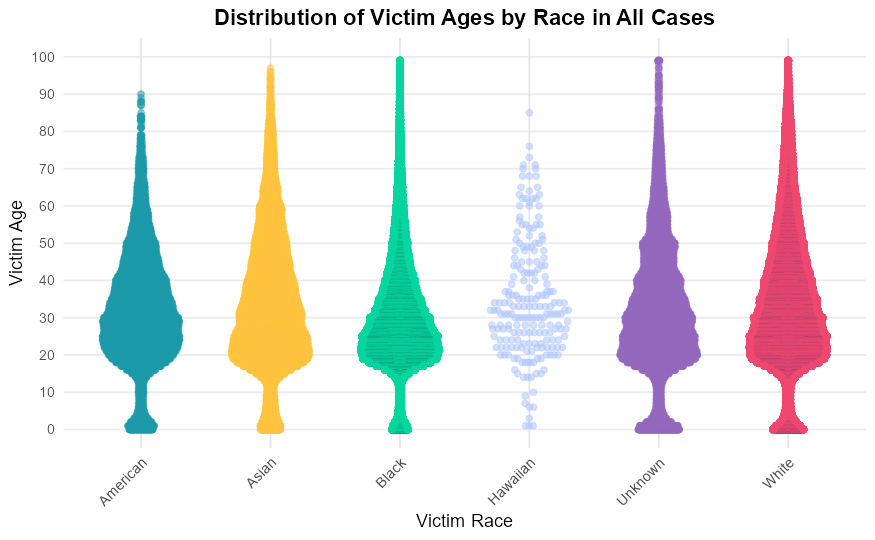

- The pattern matches between unsolved and all cases, so victim race stays in the feature set.

---

## Machine learning

Two supervised tasks, trained on solved cases and applicable to unsolved ones:

- **Classification** — offender sex (binary, 11.7% minority class)
- **Regression** — offender age in years

Features (identical for both tasks, and knowable for *unsolved* cases): `VicAge`, `Year`, `Weapon`, `VicSex`, `VicRace`, `State`, `Agentype`, `Month`, `Homicide`, `ActionType`. High-cardinality identifiers (`Agency`, `CNTYFIPS`, `Ori`, …) and anything unknown in unsolved cases (`Relationship`, `Circumstance`, `OffRace`, …) are dropped, as established by the EDA and permutation-importance analysis. Offender attributes are never inputs — they are exactly what is unknown at prediction time.

### The classic SMOTE pitfall (and why it is avoided here)

SMOTE creates synthetic minority samples by interpolating between real neighbours. Oversample the **whole dataset and split afterwards**, and the test fold contains points interpolated from training rows — the model is graded on near-copies of what it trained on, at a fake 50/50 class balance. The sweep runs that leaky protocol once, purely for contrast (`LEAKY_smote_before_split`): it scores **92.7% "accuracy"** on this dataset, while the leak-free ceiling for the same model family is ~0.63 macro-F1. Every number below comes from the leak-free protocol.

### Leak-free methodology

- **Split first**: 64/16/20 train/validation/test, stratified on offender sex (`shr/data.py`). Oversampling and preprocessing are fit on the **training fold only**. Combos are ranked on **validation**; the **test fold is spent exactly once**, on the final chosen models.
- Encoding: standardized numerics + ordinal-coded categoricals (trees don't need one-hot; SMOTENC needs to know which columns are categorical).
- 9 oversampling strategies (plus `none` and cost-sensitive `class_weight`) × 5 model families (DecisionTree, ExtraTrees, RandomForest, HistGradientBoosting, XGBoost), all with default-ish, untuned settings — the sweep isolates the effect of the *sampler*, not hyperparameters.
- Reproduce with `python experiments/oversampling_sweep.py`; full grid in `experiments/results/`.

### Classification results — best model per strategy (validation, 91,708 real cases)

Macro-F1 is the headline metric: with an 88/12 split, plain accuracy is gamed by always predicting Male (88.3% accuracy, 0.469 macro-F1, catches **zero** female offenders).

| strategy          | best model           | f1_macro | balanced_acc | recall♀ | precision♀ | ROC-AUC | accuracy |
|:------------------|:---------------------|---------:|-------------:|--------:|-----------:|--------:|---------:|
| **SMOTEENN**      | **XGBoost**          | **0.634**|    **0.644** |**0.392**|  **0.333** |**0.750**| **0.838**|
| SMOTENC           | HistGradientBoosting |    0.611 |        0.598 |   0.257 |      0.358 |   0.741 |    0.860 |
| class_weight      | RandomForest         |    0.607 |        0.602 |   0.283 |      0.320 |   0.717 |    0.846 |
| SMOTETomek        | ExtraTrees           |    0.596 |        0.586 |   0.240 |      0.320 |   0.699 |    0.852 |
| BorderlineSMOTE   | ExtraTrees           |    0.593 |        0.583 |   0.230 |      0.319 |   0.702 |    0.853 |
| SMOTE             | ExtraTrees           |    0.593 |        0.582 |   0.228 |      0.322 |   0.697 |    0.854 |
| ADASYN            | RandomForest         |    0.591 |        0.578 |   0.214 |      0.331 |   0.711 |    0.858 |
| RandomOverSampler | RandomForest         |    0.589 |        0.575 |   0.201 |      0.343 |   0.708 |    0.862 |
| SVMSMOTE ¹        | RandomForest         |    0.587 |        0.573 |   0.193 |      0.348 |   0.713 |    0.864 |
| none              | DecisionTree         |    0.562 |        0.566 |   0.250 |      0.218 |   0.567 |    0.808 |
| KMeansSMOTE ²     | —                    |        — |            — |       — |          — |       — |        — |
| *always-Male dummy* | —                  |    0.469 |        0.500 |   0.000 |          — |   0.500 |    0.883 |
| *SMOTE before split* ³ | XGBoost         |  *0.927* |      *0.927* | *0.870* |    *0.982* | *0.965* |  *0.927* |

¹ SVMSMOTE fits an SVC (O(n²)) — infeasible on 458k rows; ran on a 60k stratified subsample.
² KMeansSMOTE could not find minority-pure clusters at default settings and aborts (recorded in the results CSV).
³ The leaky protocol, included for contrast — numbers are meaningless by construction.

**Winner: SMOTEENN + XGBoost** (SMOTE oversampling followed by Edited-Nearest-Neighbours cleaning of noisy boundary points — the cleaning step is what separates it from the plain-SMOTE pack). Refit on train+val and evaluated **once on the held-out test set (114,635 cases)**:

| metric | test value |
|:--|--:|
| macro-F1 | **0.6349** |
| balanced accuracy | 0.6465 |
| recall (Female) | 0.3976 |
| precision (Female) | 0.3340 |
| ROC-AUC | 0.7501 |
| PR-AUC (Female) | 0.3109 |
| accuracy | 0.8374 |

Reading this honestly: the model trades ~4.6 points of raw accuracy against the always-Male dummy to catch **~40% of female offenders instead of 0%**. That is what class imbalance actually costs — a 92%-accuracy story was only ever available through leakage. Case features simply don't separate the sexes strongly (ROC-AUC 0.75 ceiling across all 50+ combos).

### Regression results (offender age, validation)

Oversampling is a *classification* tool; applying SMOTE to a continuous target (every age value treated as a class) is a category error, and run leak-free it strictly hurts:

| strategy | model | R² | RMSE (yrs) | MAE (yrs) |
|:--|:--|--:|--:|--:|
| none | **XGBoost** | **0.248** | **11.26** | 8.42 |
| none | HistGradientBoosting | 0.247 | 11.26 | 8.43 |
| none | XGBoost (deeper, tuned) | 0.244 | 11.29 | 8.42 |
| SMOTE age-as-classes | XGBoost (tuned) | 0.165 | 11.86 | 8.91 |
| none | RandomForest | 0.165 | 11.86 | 8.90 |
| none | ExtraTrees | 0.098 | 12.33 | 9.20 |
| none | mean-age dummy | 0.000 | 12.98 | 10.15 |
| none | DecisionTree (full depth) | −0.566 | 16.25 | 11.79 |

Final regressor (XGBoost, refit on train+val, held-out test): **R² 0.2566, RMSE 11.18 years, MAE 8.35 years** — an 8.3-year mean error against a 13-year target standard deviation; case attributes bound how much better any model can do here.

---

## Production pipeline

```
shr/                    the package
├── data.py             cleaning rules, feature lists, split, preprocessor (single source of truth)
├── train.py            python -m shr.train → models/*.joblib + metrics.json
├── api.py              FastAPI service: /predict, /health, /model-info
└── selfcheck.py        python -m shr.selfcheck — assert-based sanity checks
experiments/
├── oversampling_sweep.py   the full strategy × model comparison (resumable)
└── results/                every combo's metrics, incl. failures — the evidence for the tables above
models/                 pre-trained pipelines + their test metrics (python -m shr.train reproduces them)
notebook.ipynb          companion notebook: leak demo, sweep visualisation, test-set report
Dockerfile              serving image (models baked in, dataset stays out)
deploy/                 AWS App Runner deploy + teardown scripts
requirements-dev.txt    notebook extras (matplotlib, jupyter) on top of requirements.txt
```

### Train and serve locally

```bash
python -m venv .venv && .venv/Scripts/activate     # or source .venv/bin/activate
pip install -r requirements.txt

# pre-trained pipelines ship in models/ — retraining is optional:
# place SHR65_22.csv in the repo root (see Dataset section for the source), then
python -m shr.train          # ~2 min: fits both pipelines, writes models/ + test metrics
python -m shr.selfcheck      # "selfcheck OK"
uvicorn shr.api:app --port 8000
```

```bash
curl -X POST http://localhost:8000/predict -H "Content-Type: application/json" -d '{
  "VicAge": 34, "VicSex": "Female", "VicRace": "White", "Weapon": "Handgun",
  "State": "California", "Agentype": "Municipal police", "Month": "July", "Year": 2019
}'
# {"offender_sex":"Male","p_female":0.0561,"offender_age_years":36.6}
```

Interactive docs at `/docs`; `/model-info` returns the training provenance and held-out test metrics of the loaded artifacts. Category values never seen in training still predict, but the response carries an explicit warning.

### Docker

```bash
docker build -t shr-offender-api .        # uses the shipped models/ (retrain first if you changed anything)
docker run -p 8000:8000 shr-offender-api
```

The image ships only `shr/`, `models/` (<1 MB of artifacts) and pinned dependencies — the 318 MB dataset never enters the build context.

### Deploy to AWS

```bash
./deploy/deploy_aws.sh                    # ECR push + App Runner service, prints the HTTPS URL
AWS_REGION=eu-west-1 ./deploy/deploy_aws.sh   # any knob via env: APP_NAME, CPU, MEMORY
./deploy/teardown_aws.sh                  # removes the service + ECR repo when done
```

Requires AWS CLI v2 credentials and Docker (on Windows: run from Git Bash/WSL). App Runner gives TLS, health checks (`/health`) and autoscaling with no VPC/ALB boilerplate; the script also auto-deploys on future `:latest` pushes.

---

### Companion notebook

`notebook.ipynb` (needs `pip install -r requirements-dev.txt`) walks the evaluation with rendered outputs: it demonstrates the leak on a subsample — same data, same model, macro-F1 0.93 vs 0.56 with one line moved — then charts the sweep and reports the held-out test metrics.
